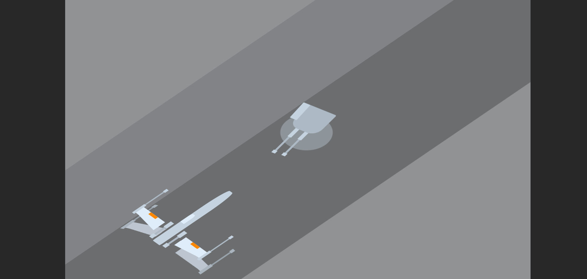

# X-Wing Animation

A small, stylish X-Wing animation built using plain HTML, CSS and JavaScript.



## Overview

This repository contains a lightweight animated X-Wing (Star Wars) built with modern CSS and a touch of JavaScript for timing and interaction. It's intended as a simple demo and a learning resource for CSS animations and transforms.

## Features

- Smooth CSS-driven animation for the X-Wing
- Responsive layout that works in modern browsers
- Minimal, easy-to-read HTML/CSS/JS for learning and customization

## Demo / Preview

Open `index.html` in your browser to view the animation locally. The screenshot above shows a frame from the animation.

## How to run

1. Clone the repository:

   ```bash
   git clone https://github.com/BinaryVortex/X-Wing-Animation.git
   cd X-Wing-Animation
   ```

2. Open the `index.html` file in your web browser (double-click or use `open`/`xdg-open`):

   ```bash
   # macOS
   open index.html

   # Linux
   xdg-open index.html

   # Windows (PowerShell)
   Start-Process index.html
   ```

No build tools or dependencies required — just a browser.

## Files

- `index.html` — the demo page
- `styles.css` — main styling and animations
- `script.js` — small JS file for interactivity/timing (if present)
- `Screenshot 2024-08-30 131947.png` — preview image included in this README

> Note: File names may vary slightly; check the repository root for exact names.

## Customize

- Edit `styles.css` to tweak colors, timing, and animation properties.
- Add additional keyframes for more complex motion.
- Replace the X-Wing markup in `index.html` to alter structure or add effects.

## Contributing

Contributions are welcome. If you have improvements, open an issue or submit a pull request with a clear description of changes.

## License

This project is open-source. If you want a specific license, add a `LICENSE` file (MIT recommended for demos).

---

Developed by BinaryVortex
